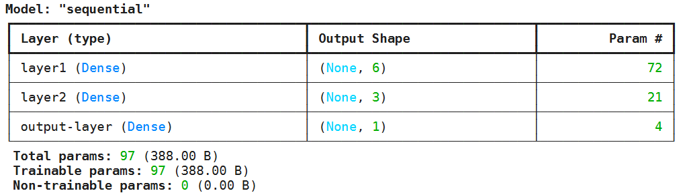
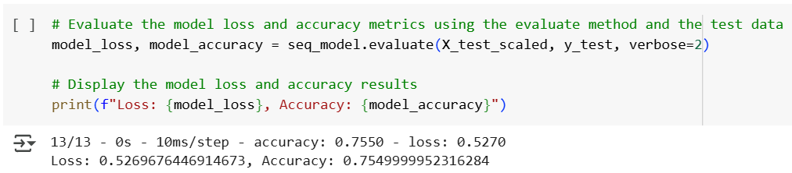
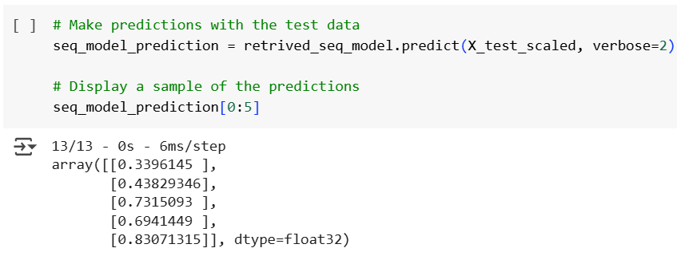
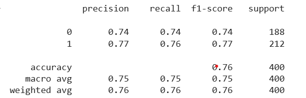

# Neural Network Challenge 1

## Student Loan Risk Model

### Sequential Model

<figure>
  
</figure>

### Accuracy & Loss Data

<figure>
  
</figure>

### Model Prediction

<figure>
  
</figure>

### Classification Report

<figure>
  
</figure>
